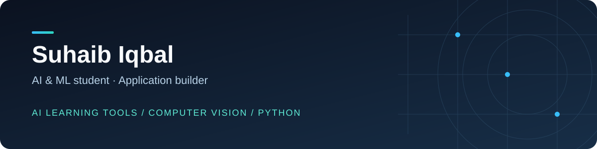

**Building practical AI applications while strengthening the fundamentals.**

[Explore projects](#selected-projects) · [Learning portfolio](#learning-portfolio) · [Repositories](https://github.com/SuhaibIqbal12?tab=repositories)

## About me

I'm **Suhaib Iqbal**, a CSE student specializing in AI & ML. My projects explore AI-assisted learning, computer vision, and web applications. I also practice Python problem solving and document my coursework here.

I care about understanding how a system works, writing clearer code, and turning experiments into useful applications.

## Selected projects

| Project | What it explores | Core technologies |
| --- | --- | --- |
| [AI Tutor Platform](https://github.com/SuhaibIqbal12/ai-tutor-platform) | Tutoring, coding practice, quizzes, study planning, and document-based learning | TypeScript, Next.js, Express, Prisma, PostgreSQL |
| [Vision Reality](https://github.com/SuhaibIqbal12/Vision-Reality) | Webcam effects, hand gestures, YOLO detection, and marker-based AR | Python, OpenCV, MediaPipe, PyTorch |
| [TomatoGuard](https://github.com/SuhaibIqbal12/tomato-disease-detector) | Image upload, prediction history, and an optional leaf-classification model workflow | Node.js, Express, MongoDB, EJS |

These are development and educational projects. Each README explains setup, current behavior, and limitations. TomatoGuard includes simulation mode; trained model weights are not bundled.

## Tools I work with

| Area | Tools |
| --- | --- |
| Programming | Python, TypeScript, JavaScript |
| Web applications | Next.js, React, Express, FastAPI |
| AI and vision | Gemini integrations, OpenCV, MediaPipe, YOLO |
| Data | PostgreSQL, Prisma, MongoDB |
| Development | Git, GitHub, VS Code, Jupyter |

## Learning portfolio

- **[Python problem solving](https://github.com/SuhaibIqbal12/leetcode-problems)** — LeetCode solutions and a topic index.
- **[AI & ML labs](https://github.com/SuhaibIqbal12/AIML_2303A52168)** — Notebooks, search algorithms, and coursework reports.
- **[Generative AI · 2025](https://github.com/SuhaibIqbal12/Generative-AI-2025)** — Weekly notebook exercises.
- **[AI-assisted coding](https://github.com/SuhaibIqbal12/AI_Assisted_Coding_2303A52168)** — PDF lab submissions.
- **[DevOps · 2026](https://github.com/SuhaibIqbal12/DevOps_2026)** — Dated lab archives.

## Current focus

- Building and refining AI learning applications.
- Exploring webcam computer vision and interactive AR.
- Improving Python, data structures, and algorithmic reasoning.
- Making project documentation easier to follow and reproduce.

---

Browse the pinned repositories below for a starting point. For questions about a public project, open an issue in its repository.
